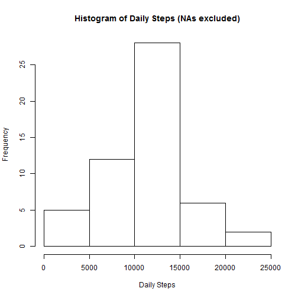
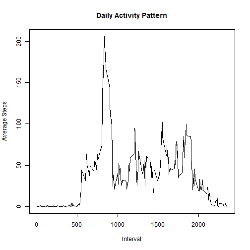
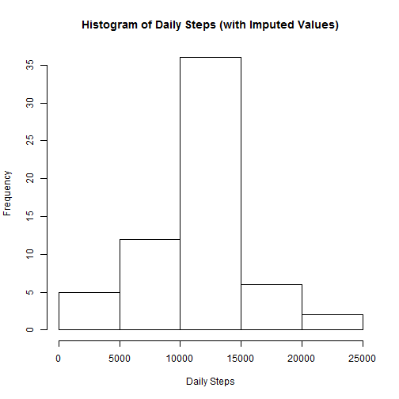

## Loading and preprocessing the data

Load libraries that will be used.


```r
library(dplyr)
library(knitr)
library(lattice)
```

Load the data and convert the date column from factor to date.


```r
#Unzip and read csv
unzip("activity.zip")
activity<-read.csv("activity.csv",header=TRUE)

#Convert date column from factor to date type
activity$date<-as.Date(as.character(activity$date))
```

## What is mean total number of steps taken per day?

Per course instructions, missing values in the dataset can be ignored.

Calculate the total number of steps per day.


```r
#Calculate total number of steps per day
daily.steps<-aggregate(activity$steps,by=list(activity$date),sum)
```

Make a histogram of total number of steps taken each day.


```r
#Histogram of the total number of steps taken each day
hist(daily.steps$x, main="Histogram of Daily Steps (NAs excluded)",xlab="Daily Steps")
```



Calculate and report the mean and median of the total number of steps taken per day.


```r
x<-mean(daily.steps$x,na.rm=TRUE)
y<-median(daily.steps$x,na.rm=TRUE)
cat("Mean:",x," ","Median:",y)
```

```
## Mean: 10766.19   Median: 10765
```


## What is the average daily activity pattern?

Time series plot of the 5-minute interval (x-axis) and the average number of steps taken, averaged across all days (y-axis)


```r
#Average number of steps per interval
activity.noNA<-na.omit(activity)  #Throw out NAs
interval.avg<-aggregate(activity.noNA$steps,by=list(activity.noNA$interval),mean)
names(interval.avg)<-c("interval","avg.steps")

#Plot of average number of steps per interval
with(interval.avg,plot(interval,avg.steps,type="l",
                       main="Daily Activity Pattern",ylab="Average Steps",xlab="Interval"))
```



Which 5-minute interval, on average across all the days in the dataset, contains the maximum number of steps?


```r
interval.max<-subset(interval.avg,interval.avg$avg.steps==max(interval.avg$avg.steps))
cat("Interval with the maximum number of steps: ",interval.max$interval)
```

```
## Interval with the maximum number of steps:  835
```


## Imputing missing values

Calculate and report the total number of missing values in the dataset. 


```r
total.NAs<-sum(is.na(activity$steps))
cat("Total number of missing values: ",total.NAs)
```

```
## Total number of missing values:  2304
```

The strategy to fill in the missing values will be to use the average for each 5-minute interval exlusive of NAs, calculated above, in place of the missing value.

Create a new dataset that is equal to the original dataset but with the missing values filled in:


```r
#Copy the original data set to create a new dataset
activity.imputed<-activity

#Interate through each row of the new dataset.  
#If the steps value for the row is NA, replace that value with the interval average
for (i in 1:nrow(activity)){
    if (is.na(activity$steps[i])){
      activity.imputed$steps[i]<-interval.avg[interval.avg$interval==activity$interval[i],]$avg.steps
    }
}
```

Make a histogram of the total number of steps taken each day.


```r
#make histogram
daily.steps.imputed<-aggregate(activity.imputed$steps,by=list(activity.imputed$date),sum)
hist(daily.steps.imputed$x,main="Histogram of Daily Steps (with Imputed Values)",xlab="Daily Steps")
```



Calculate and report the mean and median total number of steps taken per day.


```r
#mean and mean of total number of steps with imputed data
x<-mean(daily.steps.imputed$x)
y<-median(daily.steps.imputed$x)
cat("Mean:",x," ","Median:",y)
```

```
## Mean: 10766.19   Median: 10766.19
```

Do these values differ from the estimates from the first part of the assignment? 

  * Only minimally, the mean remains identical but the median has converged to the mean, but the trivial amount of 1.19 steps.


What is the impact of imputing missing data on the estimates of the total daily number of steps?

  * Imputing the missing data using the adopted technique reinforces the previously-calculated mean and causes the median to converge towards the mean.
  

## Are there differences in activity patterns between weekdays and weekends?

Create a new factor variable in the dataset with two levels - "weekday" and "weekend" indicating whether a given date is a weekday or weekend day.


```r
#Use the weekdays() function to mutate the date column into a day name
activity.imputed<-mutate(activity.imputed,Day=weekdays(activity.imputed$date))

#For each row, classify the day as either weekday or weekend, replacing the existing value
for (i in 1:nrow(activity.imputed)){
  if (activity.imputed$Day[i]=="Saturday" | activity.imputed$Day[i]=="Sunday"){
     activity.imputed$Day[i]<-"weekend" 
  }
  else activity.imputed$Day[i]<-"weekday"
}

#Convert the Day column to a factor
activity.imputed$Day<-as.factor(activity.imputed$Day)

#Verify
str(activity.imputed$Day)
```

```
##  Factor w/ 2 levels "weekday","weekend": 1 1 1 1 1 1 1 1 1 1 ...
```

Make a panel plot containing a time series plot of the 5-minute interval (x-axis) and the average number of steps taken, averaged across all weekday days or weekend days (y-axis).


```r
#Aggregate by interval, day
interval.steps<-aggregate(activity.imputed$steps,by=list(activity.imputed$interval,activity.imputed$Day),mean)
names(interval.steps)<-c("interval","day","avg.steps")

#Make plot
with(interval.steps,xyplot(avg.steps~interval|day, type="l",
                           ylab="Number of steps",xlab="Interval",layout=c(1,2)))
```


